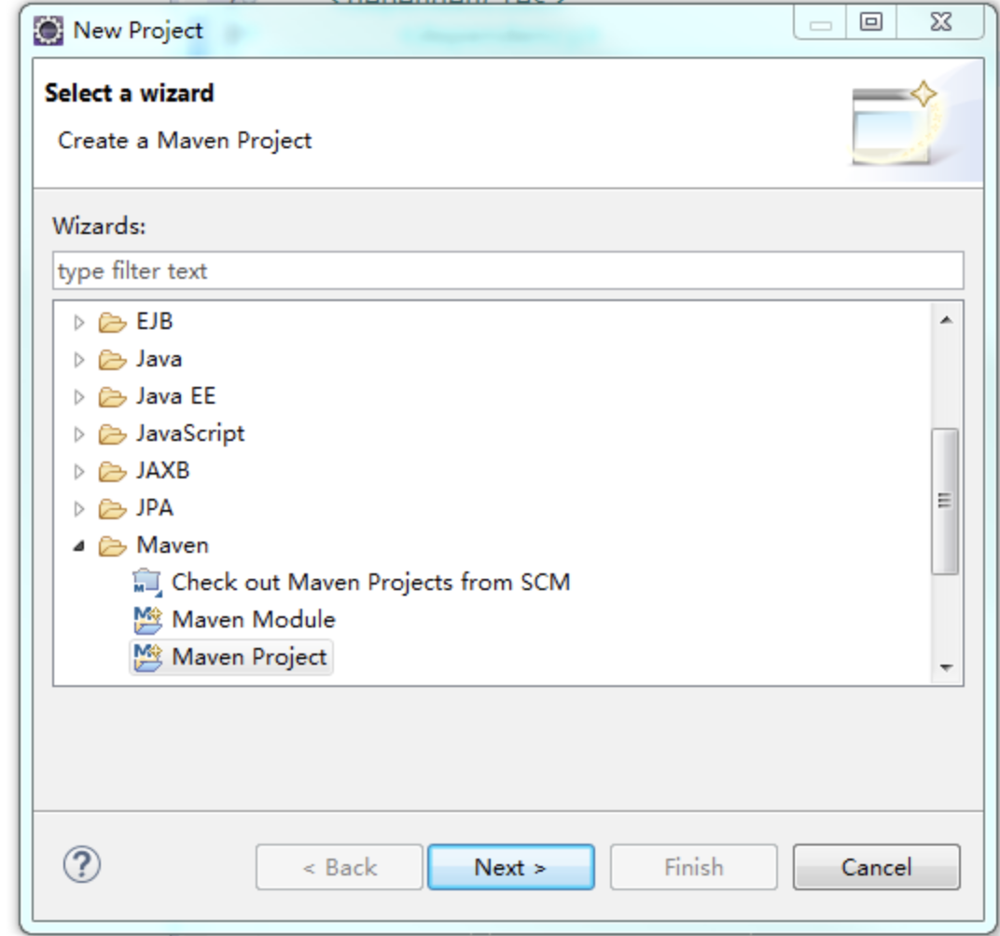
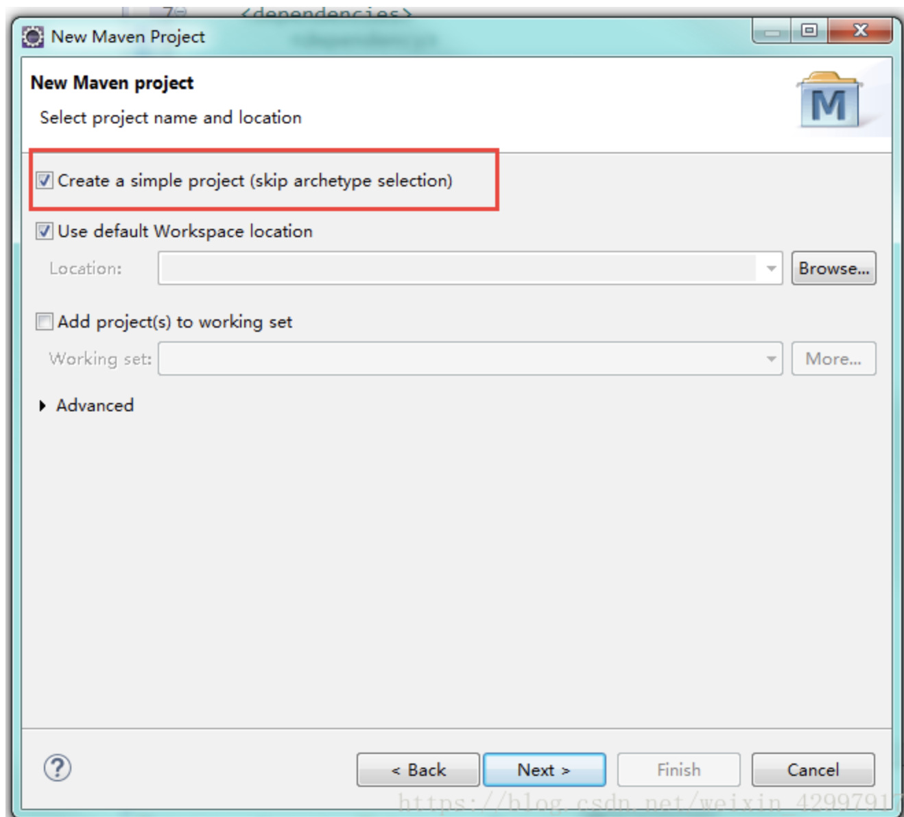
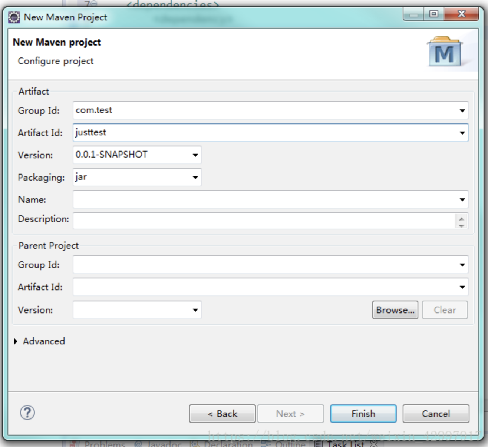
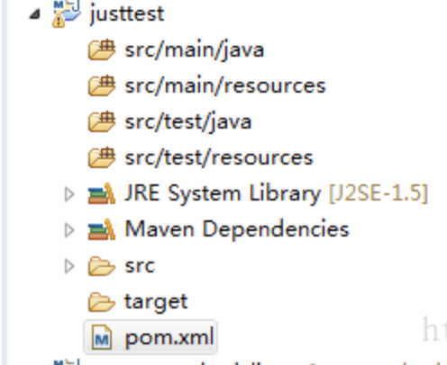

# exercise-2
### 新建 Springboot 项目

- eclipse中新建maven项目。

  1、创建maven项目

  

  2、创建一个simple project 勾上

  

3、填上groupid和artifactid就可以啦



4、展现项目结构：




5、修改pom.xml文件，主要修改maven坐标和jar包名称，参考：

```xml
<?xml version="1.0" encoding="UTF-8"?>
<project xmlns="http://maven.apache.org/POM/4.0.0"
         xmlns:xsi="http://www.w3.org/2001/XMLSchema-instance"
         xsi:schemaLocation="http://maven.apache.org/POM/4.0.0 http://maven.apache.org/xsd/maven-4.0.0.xsd">
    <modelVersion>4.0.0</modelVersion>

    <!--  maven坐标，根据喜好更改  -->
    <groupId>com.xcxu</groupId>
    <artifactId>ocpexample</artifactId>
    <version>1.0-SNAPSHOT</version>

    <packaging>jar</packaging>
    <properties>
        <project.reporting.outputEncoding>UTF-8</project.reporting.outputEncoding>
        <java.version>1.8</java.version>
        <maven.compiler.source>${java.version}</maven.compiler.source>
        <project.build.sourceEncoding>UTF-8</project.build.sourceEncoding>
        <maven.compiler.target>${java.version}</maven.compiler.target>
        <spring.boot.version>2.1.6.RELEASE</spring.boot.version>
    </properties>

    <dependencyManagement>
        <dependencies>
            <dependency>
                <groupId>org.springframework.boot</groupId>
                <artifactId>spring-boot-dependencies</artifactId>
                <version>${spring.boot.version}</version>
                <type>pom</type>
                <scope>import</scope>
            </dependency>
        </dependencies>
    </dependencyManagement>

    <dependencies>

        <dependency>
            <groupId>org.springframework.boot</groupId>
            <artifactId>spring-boot-starter-web</artifactId>
        </dependency>
        <dependency>
            <groupId>org.springframework.boot</groupId>
            <artifactId>spring-boot-starter</artifactId>
        </dependency>
        <dependency>
            <groupId>org.projectlombok</groupId>
            <artifactId>lombok</artifactId>
            <scope>compile</scope>
            <optional>true</optional>
        </dependency>
        <dependency>
            <groupId>org.springframework.boot</groupId>
            <artifactId>spring-boot-starter-test</artifactId>
            <scope>test</scope>
        </dependency>
    </dependencies>


    <build>

        <!-- jar包名称  -->
        <finalName>ocpexample</finalName>
        <plugins>
            <plugin>
                <groupId>org.springframework.boot</groupId>
                <artifactId>spring-boot-maven-plugin</artifactId>
                <version>2.2.5.RELEASE</version>
                <executions>
                    <execution>
                        <goals>
                            <goal>repackage</goal>
                        </goals>
                    </execution>
                </executions>
            </plugin>
        </plugins>
    </build>
</project>
```


### 新建  App.java 类

```java
package com.xcxu.ocpdemo;

import org.springframework.boot.SpringApplication;
import org.springframework.boot.autoconfigure.SpringBootApplication;

@SpringBootApplication
public class App {
    public static void main(String[] args) {
        SpringApplication.run(App.class, args);
    }
}
```


### 新建 HelloWorldController.java 类

```java
package com.xcxu.ocpdemo.contoller;

import org.springframework.web.bind.annotation.GetMapping;
import org.springframework.web.bind.annotation.RestController;

@RestController
public class HelloWorldController {

    @GetMapping("/")
    public String helloWorld() {
        return "hello Springboot OCP-4 xcxu";
    }
}
```


### 新建 application.yml 文件

```yaml
spring:
  application:
    name: ocpexample

server:
  port: 8080
```

### 项目目录结构：

``` powershell
├── pom.xml
├── src
│   └── main
│       ├── java
│       │   └── com
│       │       └── xcxu
│       │           └── ocpdemo
│       │               ├── App.java
│       │               └── contoller
│       │                   └── HelloWorldController.java
│       └── resources
│           └── application.yml
```

### 选择 S2I 方式部署程序

按照作业1的方式部署项目。

### 查看部署效果
访问route地址，页面显示： hello Springboot OCP-4 xcxu